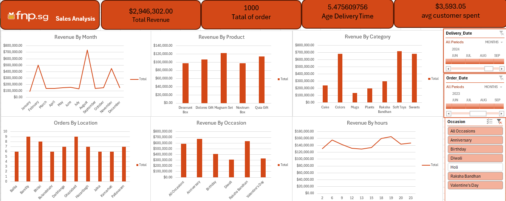

# 🎁 Gift Shop Sales Analysis Dashboard

## 📌 Project Overview
This project provides a detailed analysis of sales data for a gift shop (similar to FNP). The goal was to track performance across various categories like Cakes, Flowers, and Personalized Gifts, while analyzing how different occasions (Holi, Valentine's Day, Anniversaries) impact overall revenue.

## 📸 Dashboard Preview

  

## 🛠️ Key Features & Skills Applied
- **Data Integration:** Consolidated multiple datasets including Orders, Customers, and Products to create a unified data model.
- **Time-Series Analysis:** Analyzed sales trends by month and day of the week to identify peak shopping periods.
- **Occasion-Based Insights:** Categorized revenue based on holidays and personal celebrations to optimize stock management.
- **Delivery Performance:** Calculated the average time difference between order and delivery dates to monitor operational efficiency.
- **Advanced Pivot Tables:** Used grouped pivot tables to visualize:
    - Revenue by Product Category (Colors, Soft Toys, Sweets, etc.).
    - Sales distribution by City.
    - Top-performing products and gift boxes.

## 🧰 Tools Used
- **Microsoft Excel** (Data Cleaning, Pivot Tables, Advanced Formulas)
- **Interactive Dashboards** (Slicers, Dynamic Charts)

## 📊 Key Insights
- Identified "Soft Toys" and "Colors" as the highest revenue-generating categories.
- Detected significant sales spikes during February (Valentine's Day) and August.
- Analyzed delivery metrics to ensure customer satisfaction through timely shipping.# Gifts-Shop-Sales-Analysis-Excel
Comprehensive sales analysis for a gift and flower shop using Excel. Includes data transformation, occasion-based sales tracking, and a dynamic dashboard to monitor revenue, top products, and delivery performance
